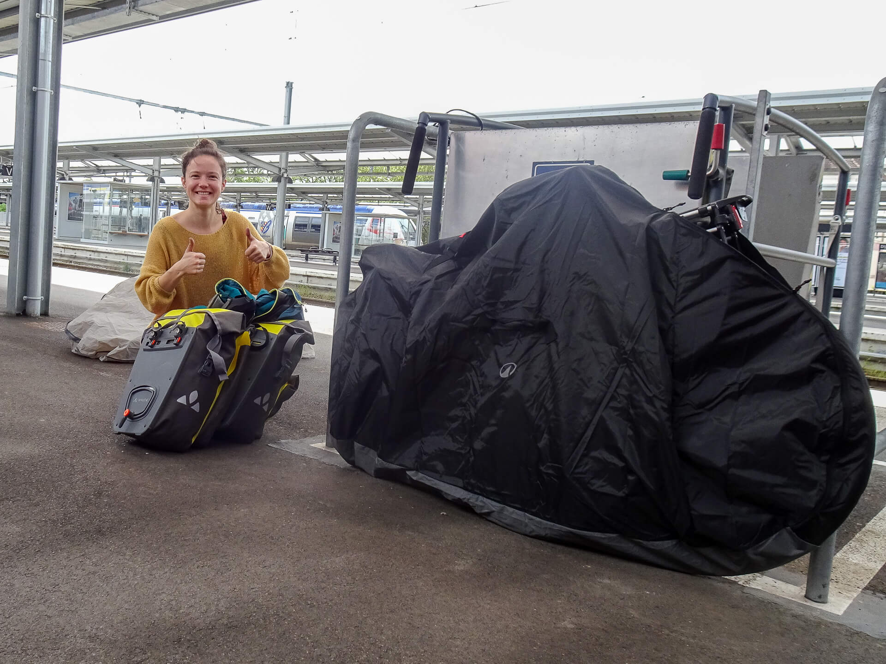
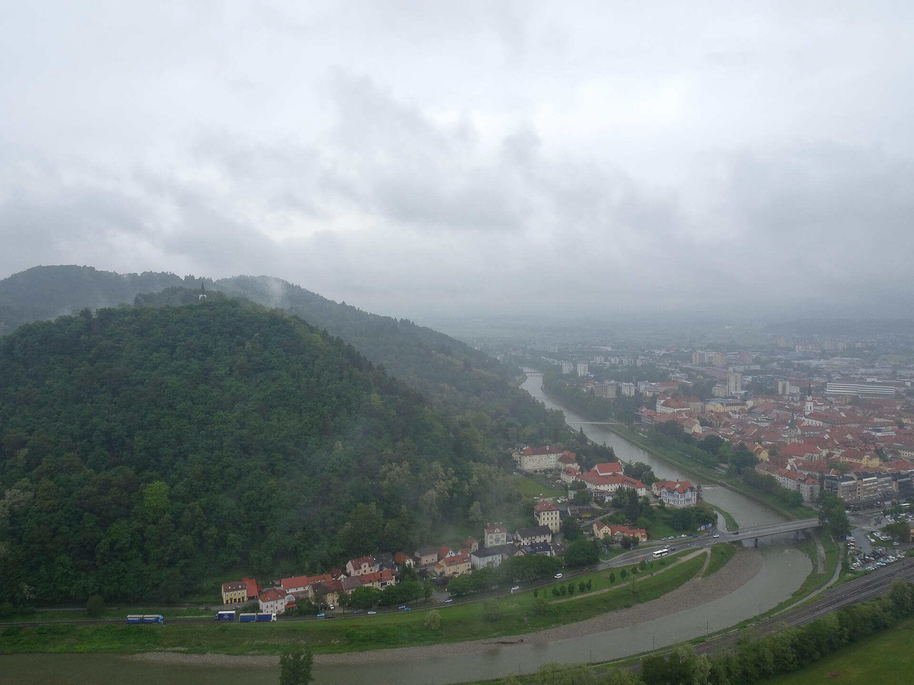
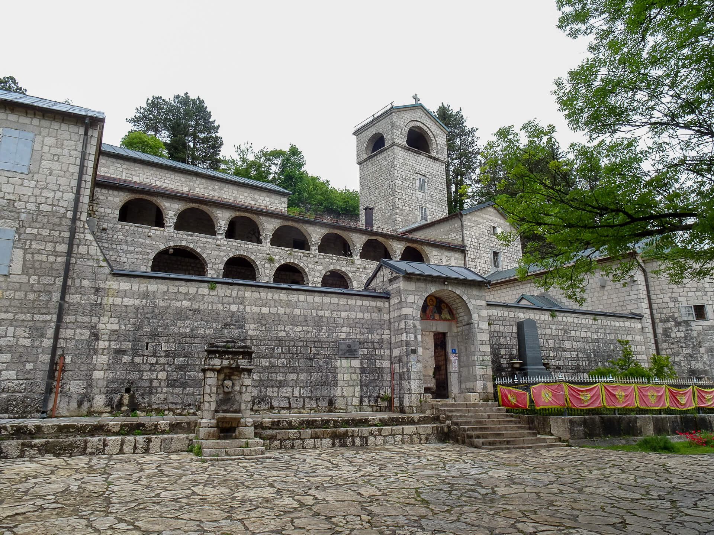
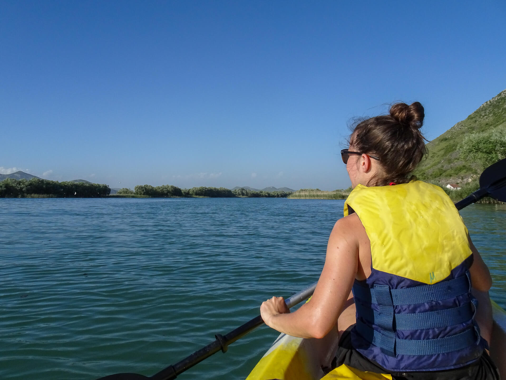

>## J-1 - Avant le grand départ 🇫🇷

Quelques préparatifs, accompagnés de notre fidèle balance de cuisine : tout est passé au crible pour partir léger léger 🪶

 

>## J0 - Dijon > Zurich 🇨🇭
>*Dimanche 5 mai 2024*

Sur le quai de la gare à **Dijon**, premier emballage de vélo d'une longue série... Cette fois, c'est parti !

 
Petite escale à **Zurich**, point de départ de notre train de nuit :

 

 

Et voilà qu'on entend siffler le train... 🚂

 

>## J1 - Maribor > Ptuj 🇸🇮
>*Lundi 6 mai 2024*

Nos premiers tours de roue en **Slovénie** !

 

Les insolites du jour :

  

Maxime, star photogénique du jour :
 
 

 

 

>## J2 - Ptuj > Poljčane 🇸🇮
>*Mardi 7 mai 2024*

 

À **Ptuj**, on avait réservé un petit gîte, pour un début de voyage pas trop rude.
On en profite pour laisser les vélos et visiter, les mains dans les poches :-)

 

 

  

Instant kitsch :

 

Et on re-décolle, cette fois ça commence à monter... On découvre pour de bon les si jolis paysages de **Slovénie**. ⛰

On arrive à **Poljčane** avant la nuit, le temps de trouver un endroit pour poser la tente, et surtout un bar pour ne pas rater PSG - Dortmund !
Le patron ne parle qu'allemand, mais on arrive à comprendre qu'il va diffuser le match, ouf.

Résultat des courses : 5 poteaux, tristesse, élimination, mais nos amis d'un soir nous paient des coups pour nous consoler. 🥹

>## J3 - Poljčane > Celje 🇸🇮
>*Mercredi 8 mai 2024*

Après la défaite de la veille, assortie d'une chute pour Manon dans le chemin creux qui menait à notre tente, voilà qu'on se fait cueillir par la pluie !

On ne demande pas notre reste, on attrape un train qui passait là pour notre destination du jour : **Celje**. Là, petite côte pour monter au château, et quitte à être sous la flotte, on profite de la visite.

 

 

On ne dirait peut-être pas comme ça, mais les vues sont magnifiques !

 

Allez zou, on redescend, on a notre 2ème train de nuit à prendre : direction la **Croatie**. 🚂

Une fois en bas, on trouve le temps de faire quelques courses, assister à un concert de jeunes espoirs classiques, et surtout notre occupation du moment : faire sécher notre tente au milieu de la gare.

>## J4 - Hvar 🇭🇷
>*Jeudi 9 mai 2024*

Arrivée à **Split** sous le soleil :

 

On embarque sur le bateau pour l'île de **Hvar**, après avoir ENCORE démonté les vélos, et négocié sec pour ne pas les compter comme "une personne" mais comme "un bagage".

 

 

Prêts à avaler notre première vraie montée 💪🦵

 

  

On descend pour une baignade de l'autre côté de l'île, on remonte un coup, souvent accompagnés de groupes en vélo électrique...

Et il est déjà temps de trouver où planter la tente : ce soir, ce sera dans un champ d'oliviers. 🫒

 

>## J5 - Hvar > Jezero Vrutak 🇧🇦
>*Vendredi 10 mai 2024*

Cette nuit, des amis sangliers sont venus nous dire bonjour ! 🐗

 

 

On profite de la traversée de bon matin, pour admirer les montagnes qui nous attendent à terre :

Petites courses, crème solaire, et ça remonte en selle !

 

Il est temps de redescendre le long de la rivière, pour filer vers la **Bosnie** mais aussi pour rencontrer la joie du voyage à vélo n°2 : le vent de face. 💨💨

 

Et... ça y est, on est passés ! Nous voilà en **Bosnie** ! 🇧🇦

 

 

 

>## J6 - Jezero Vrutak > Dubrovnik (Ćiro Trail) 🇧🇦
>*Samedi 11 mai 2024*

Le jour se lève calmement... 🏕⛺

 

 

 

Vers les grands espaces ! On entame la **Ćiro Trail**, l'une des très belles portions du voyage...

  

  

 

 

  

Un village ! Vite, arrêt au café ! 😍

 

Quelques belles rencontres sur le chemin...

 

  

On traverse **Hum**, ville abandonnée après la guerre, où la nature reprend ses droits.

 

Une dernière montée, avant de redescendre vers la mer... Fin de cette première escapade en **Bosnie**, qui nous aura beaucoup touchés !

  

Re-passage de frontière (plus simple, celui-là) et c'est l'arrivée sur les hauteurs de **Dubrovnik**.

  

 

  

>## J7 - Dubrovnik 🇭🇷
>*Dimanche 12 mai 2024*

Aujourd'hui, c'est journée repos : on fait les touristes à **Dubrovnik** !
Bon, on n'avait pas capté que c'était un pont de mai, et qu'il y aurait foule de personnes venues "en week-end".

  

  

  

 

Nos amies les bêtes sont toujours là :

   

 

Allez zou, on continue la visite :

   

  

  

Fin de journée sur cette jolie ville croate... et c'est la fête dans les rues !

  

>## J8 - Dubrovnik > Herceg Novi 🇲🇪
>*Lundi 13 mai 2024*

La journée commence avec une motiv' lever de soleil 🌅

 

 

 

Pas de photo du reste, car c'est un bout de journée à oublier !

On était partis, la fleur au fusil 🌸, pour prendre un court bus qui nous faisait éviter la dangereuse route du bord de côte croate (qu'on avait déjà expérimentée quelques jours plus tôt).

Une crevaison, 2 chauffeurs de bus têtus, une baignade par dépit, et finalement une navette aéroportuaire plus tard... nous voilà, avec nos vélos, à l'écart de **Dubrovnik** : à l'aéroport !

 

Nous voici au **Monténégro** ! 🇲🇪

>## J9 - Herceg Novi > Kotor 🇲🇪
>*Mardi 14 mai 2024*

Cette nuit, c'était étape au camping : arrivés à la nuit, on n'a pas eu le temps de chercher un spot de bivouac discret, et le panneau à la frontière "NO CAMPING" était pour le moins dissuasif.

  

Et c'est parti pour la course-poursuite avec le bateau de croisière qui traverse la baie 🚲🚲🚲

  

 

 

Tant pis pour la course-poursuite :

 

 

 

Et nous voilà à **Kotor**, où on retrouve la cargaison débarquée du ferry !

  

Le jour tombe, les cargaisons repartent : à nous le tourisme !

   

  

>## J10 - Kotor > Lovćen (Serpentine) 🇲🇪
>*Mercredi 15 mai 2024*

Après une nuit au-dessus de la seule boîte de nuit de la paisible ville de **Kotor**, et quelques cartes postales dessinées au café... on a des fourmis dans les jambes et hâte d'entamer la superbe montée qu'on avait dans le radar depuis le début : la fameuse **Serpentine**.

Pneus gonflés au max, bidons remplis, on est chauds ! 🔥

  

  

 

 

Pique-nique, café, puis on profite d'avoir encore un peu de feu dans les jambes pour continuer vers le **Mausolée de Njegos**.

 

 

>## J11 - Lovćen > Skadar 🇲🇪
>*Jeudi 16 mai 2024*

Joie du voyage à vélo n°4 : rouler sous la flotte !

 

Et ça descend tout droit vers **Cetinje**, ancienne capitale du **Monténégro**.

 

 

Comme d'hab, on va au café se sécher, on cherche un peu de wifi pour gérer les préparatifs des travaux, et on en profite pour quelques courses (des fruits, ça nous manquait ! 🍒)

  

Petit détour par le musée : on veut y voir la carte géante en relief du **Monténégro**, réalisée par l'empire austro-hongrois pour des raisons de stratégie militaire. Un rappel de la situation particulièrement tourmentée de ce petit pays à travers les siècles, toujours au croisement des routes et des conflits...

Nous voilà secs, il est l'heure de repartir vers le **Lac de Skadar**, notre objectif du jour.

On monte dans les graviers, il fait chaud, on est dans la poussière, les vélos secouent, on pense avoir la bonne idée de trouver un raccourci... Raté !

Heureusement on sera bientôt récompensés de nos efforts, nous voilà au bord d'une belle rivière.

 

 

Fin de la pause, on reprend encore une fois de la hauteur, croisant des milliers de petites grenouilles qui filent vers l'eau ! 🐸

 

Nous voilà sur une route en balcon, plus besoin de monter, juste faire tourner les jambes et profiter de l'horizon en cette lumière de fin de journée.

  

 

 

 

Les insolites du jour :

 

  

Oui, on a finalement trouvé un bivouac à côté des vaches. On y a siroté une petite bière après une baignade dans la rivière. On s'y est encore fait un copain chien d'ailleurs ! À cette heure, toutes les péripéties sont oubliées. Rendez-vous demain... 🌜

>## J12 - Skadar 🇲🇪
>*Vendredi 13 mai 2024*

Le voici, le fameux bivouac au bord de l'eau !

 

Peut-être un peu trop au bord de l'eau ? 🙊

 

Après 3 heures à patauger dans le lac pour faire 5 km, on va sécher nos chaussettes... au café ! Café bien noir d'ailleurs, à la turque ou plutôt "à la bosnienne" comme on dit ici. Une ribambelle d'oiseaux nous y réconforte. 🐤

  

  

Ellipse narrative : suite continue de tentatives de traverser le lac, toutes soldées par des échecs. Un chemin qui ne passe pas, un pont bien dangereux emprunté par une flopée de poids-lourds, un demi-tour tortueux, une autre route infructueuse... on trouve enfin une solution : prendre le train !

 

Pleins de reconnaissance et après une nouvelle journée riche en aventures, on s'offre enfin une sortie sur le lac dans un moyen de transport adapté. 💙

 

 

Suite de la visite naturaliste :

  

  

 

On s'offre un resto au bord de l'eau, et on file au camping, pas le temps de chercher un meilleur emplacement !

>## J13 - Skadar > Biogradska Gora 🇲🇪
>*Samedi 14 mai 2024*

Courte nuit aujourd'hui, car on veut sauter dans l'un des seuls trains de la journée pour monter au nord du **Monténégro**, vers la forêt primaire de **Biogradska Gora**. 🌳

  

Nous voilà à **Kolašin**, mignonne station de sports d'hiver. L'occasion de prendre un café, et de passer à l'office du tourisme demander des conseils d'itinéraires vélo (on fait les choses bien non ?)

 

 

On s'est obstinés un peu, mais c'est de pire en pire ! Un pur chemin de VTT, qui monte sans discontinuer dans des cailloux gros comme une tête. Heureusement, Komoot nous indique bientôt un "point d'info" : allez, du courage, on essaie d'aller au moins jusque là.

 

Que faire ? Redescendre ? Ce sera presque aussi pénible que la montée. Continuer ? Mais on ne sait pas comment on pourra redescendre de l'autre côté...

On a choisi la montée !

  

 

Reste l'affaire de la descente. Après un jus de cassis offert par les tenanciers de petites cabanes "gîte nature", qui bricolent pour préparer la saison, et nous confirment que la seule route par ici est celle qu'on a empruntée (1h en 4x4 🚙), on s'attend au pire.

Mais qu'à cela ne tienne, on est venus pour plonger au coeur de cette fameuse forêt !

  

 

On est bien vite tirés de notre contemplation par la difficulté de la tâche : il faut descendre un chemin de rando, en portant vélos et sacoches, par dessus des arbres tombés au milieu du chemin (forêt primaire oblige), et avec une sacrée pente !

 

  

 

On a bien cru ne pas l’atteindre avant la nuit. Un panneau explicatif nous informe qu'on vient de faire 600m de D-, vélos et sacoches en main : belle perf les amis. 🙃

Réconfort du jour : un couple de français croisés dans la descente (mais à pied, eux) nous ont attendus pour ouvrir la bière qu'il leur restait. On mange ensemble nos nouilles, en se racontant nos galères respectives de la journée. Du baume au coeur !

> Photo by [mymind](https://unsplash.com/@mymind) and [Luke Chesser](https://unsplash.com/@lukechesser) on [Unsplash](https://unsplash.com/)